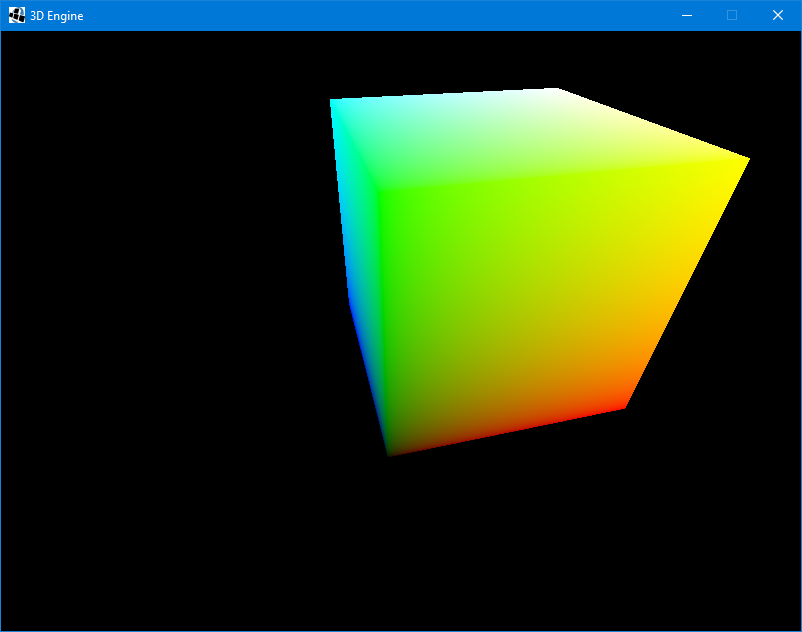

# 3DEngine

Using Java to write a 3D Engine for exercising and reinforce my computer grahic knowledge.

**Demo:**

**Texture Demo(with some troubles):**

**About perspective zNear and zFar**

The zNear & zFar values define the distance between the camera position & the near and far clipping planes, respectively. 

There is a good picture to discribe the perspective.

## TODO LIST
- fix key press bug
- add lighting
